# Shanzhu 权限管理系统

> 基于 **Spring Boot 4.x + Vue 3** 构建的现代化企业级权限管理系统，提供完整的 RBAC 权限控制、系统监控、日志管理等核心能力，可作为业务系统的基础脚手架快速落地。

---

## 📋 目录

- [项目简介](#项目简介)
- [技术栈](#技术栈)
- [项目结构](#项目结构)
- [模块说明](#模块说明)
- [功能特性](#功能特性)
- [环境要求](#环境要求)
- [快速开始](#快速开始)
- [配置说明](#配置说明)

---

## 项目简介

Shanzhu 是一套前后端分离的权限管理系统，后端采用 Spring Boot 4.x + Java 25 虚拟线程，前端采用 Vue 3 + TypeScript + Ant Design Vue，具备高性能、易扩展、开箱即用的特点，适合作为企业内部管理系统或泰国业务系统的基础框架进行二次开发。

---

## 技术栈

### 后端

| 技术 | 版本 | 说明 |
|------|------|------|
| Spring Boot | 4.0.5 | 核心框架 |
| Java | 25 | 开启虚拟线程，高并发支持 |
| MySQL | 8.2.0 | 主数据库 |
| MyBatis-Plus | 3.5.16 | ORM 持久层框架 |
| Redisson | 4.2.0 | Redis 客户端，支持分布式缓存 |
| Caffeine | 3.2.3 | 本地缓存，与 Redis 构成二级缓存 |
| dynamic-datasource | 4.5.0 | 多数据源支持 |
| JWT (java-jwt) | 4.5.1 | 无状态令牌认证 |
| SpringDoc (OpenAPI) | 3.0.2 | 接口文档自动生成 |
| tianai-captcha | 1.5.5 | 滑块/点选验证码 |
| ip2region | 3.2.0 | 离线 IP 归属地解析 |
| Snail-Job | 1.10.0 | 分布式定时任务调度 |
| Aliyun OSS | 3.18.5 | 阿里云对象存储（可选） |
| OSHI | 6.6.4 | 服务器硬件信息采集 |

### 前端

| 技术 | 版本 | 说明 |
|------|------|------|
| Vue | 3.5.x | 核心框架 |
| TypeScript | 5.9.x | 类型安全 |
| Vite | 8.0.x | 构建工具 |
| Ant Design Vue | 4.2.x | UI 组件库 |
| Pinia | 2.x | 状态管理 |
| Vue Router | 4.x | 路由管理 |
| Axios | 1.x | HTTP 请求 |
| TinyMCE | 8.x | 富文本编辑器 |
| VueUse | 13.x | 组合式工具库 |

---

## 项目结构

```
shanzhu/
├── shanzhu-admin/              # 启动模块（应用入口）
│   └── src/main/
│       ├── java/com/shanzhu/
│       │   ├── ShanzhuApplication.java   # 启动类
│       │   └── started/Banner.java       # 自定义 Banner
│       └── resources/
│           ├── application.yml           # 主配置
│           ├── application-dev.yml       # 开发环境配置
│           └── application-prod.yml      # 生产环境配置
│
├── shanzhu-base/               # 基础能力层（各功能基础模块）
│   ├── shanzhu-common/         # 公共工具、异常、响应模型
│   ├── shanzhu-security/       # 安全认证（JWT + Spring Security）
│   ├── shanzhu-cache/          # 二级缓存（Caffeine + Redisson）
│   ├── shanzhu-mybatis/        # MyBatis-Plus 持久层封装
│   ├── shanzhu-web/            # Web 层公共配置（拦截器、过滤器等）
│   ├── shanzhu-log/            # 操作日志、登录日志
│   ├── shanzhu-dict/           # 数据字典
│   ├── shanzhu-excel/          # Excel 导入导出
│   ├── shanzhu-attachment/     # 附件管理（本地/阿里云 OSS）
│   ├── shanzhu-captcha/        # 图形验证码（滑块/点选）
│   ├── shanzhu-ip/             # IP 归属地解析
│   ├── shanzhu-doc/            # 接口文档（OpenAPI/Swagger）
│   ├── shanzhu-job/            # 定时任务（Snail-Job）
│   ├── shanzhu-sensitive/      # 数据脱敏
│   └── shanzhu-websocket/      # WebSocket 实时通信
│
├── shanzhu-biz/                # 业务层
│   ├── shanzhu-system/         # 系统核心业务（用户、角色、菜单、部门等）
│   └── shanzhu-monitor/        # 系统监控（在线用户、服务监控、缓存监控）
│
├── shanzhu-vue/                # 前端工程（Vue 3 + TypeScript）
│
├── sql/                        # 数据库初始化脚本
├── docker/                     # Docker 部署配置
└── static-image/               # 项目截图
```

---

## 模块说明

### shanzhu-base 基础能力层

| 模块 | 功能说明 |
|------|---------|
| `shanzhu-common` | 统一响应模型、全局异常、常用工具类（日期、JSON、树形结构、字符串等） |
| `shanzhu-security` | 基于 JWT 的无状态认证，Spring Security 权限控制，支持令牌自动刷新 |
| `shanzhu-cache` | Caffeine 本地缓存 + Redisson 分布式缓存构成二级缓存，支持 Redis 发布订阅同步本地缓存失效 |
| `shanzhu-mybatis` | MyBatis-Plus 封装，自动填充、逻辑删除、分页等 |
| `shanzhu-web` | 全局异常处理、跨域配置、请求拦截、IP 黑名单过滤 |
| `shanzhu-log` | AOP 切面实现操作日志自动记录，登录日志异步写入 |
| `shanzhu-dict` | 字典数据查询与翻译工具类，支持普通字典和树形字典 |
| `shanzhu-excel` | 基于 EasyExcel 封装，支持字典翻译、下拉框、批注等注解扩展 |
| `shanzhu-attachment` | 附件上传下载，支持本地存储和阿里云 OSS，策略模式切换 |
| `shanzhu-captcha` | 天爱滑块/点选验证码，支持二次验证，验证码数据存 Redis |
| `shanzhu-ip` | 基于 ip2region 的离线 IP 归属地解析 |
| `shanzhu-doc` | SpringDoc 接口文档自动生成，访问 `/swagger-ui.html` |
| `shanzhu-job` | 集成 Snail-Job 分布式定时任务 |
| `shanzhu-sensitive` | 手机号、身份证、邮箱等敏感数据脱敏注解 |
| `shanzhu-websocket` | WebSocket 实时消息推送 |

### shanzhu-biz 业务层

| 模块 | 功能说明 |
|------|---------|
| `shanzhu-system` | 用户管理、角色管理、菜单管理、部门管理、岗位管理、通知公告、系统设置 |
| `shanzhu-monitor` | 在线用户监控、服务器监控、缓存监控、登录日志、操作日志 |

---

## 功能特性

### 🔐 权限管理（RBAC）
- 基于角色的访问控制，支持菜单级、按钮级权限粒度
- 用户支持多部门，可指定默认部门
- 前后端均提供接口获取当前用户权限信息

### 👤 用户与组织
- 用户管理：新增、编辑、重置密码、启用/禁用、导入导出
- 角色管理：角色与菜单权限绑定，支持数据权限范围
- 菜单管理：目录/菜单/按钮三级结构，动态路由
- 部门管理：树形组织架构
- 岗位管理：岗位与部门关联

### 📖 字典管理
- 支持普通字典和树形字典
- 前端提供 `dict-tag` 组件，通过 value 自动展示 label 并匹配样式

### 📢 通知公告
- 集成 TinyMCE 富文本编辑器
- 基于 SSE（Server-Sent Events）实现消息实时推送

### 👤 个人中心
- 修改头像、个人信息、密码
- 个性化主题配置（主题色、布局、导航模式、暗色模式）

### ⚙️ 系统设置（管理员）
- 默认密码配置
- 定期修改密码策略
- 同账号登录限制
- 自助注册开关
- 登录验证码开关
- IP 黑名单管理
- 全局灰色模式

### 📊 系统监控
- **在线用户**：查看当前在线用户，支持强制下线
- **服务监控**：CPU、内存、磁盘、JVM 等服务器信息（基于 OSHI）
- **缓存监控**：Redis 缓存信息查看与清理
- **登录日志**：记录用户登录行为、IP、地区、浏览器信息
- **操作日志**：AOP 自动记录接口操作，支持请求参数和响应结果

### 📁 附件管理
- 支持本地存储和阿里云 OSS 两种模式，配置一键切换
- 文件下载链接支持过期时间控制
- 支持公开文件和私有文件区分

### ⏰ 定时任务
- 集成 Snail-Job 分布式任务调度平台

---

## 环境要求

| 环境 | 版本要求 |
|------|---------|
| Java | 25（推荐）/ 21+（需关闭虚拟线程配置） |
| MySQL | 8.0+ |
| Redis | 6.0+ |
| Node.js | 22+ |
| Maven | 3.8+ |

---

## 快速开始

### 1. 初始化数据库

```bash
# 执行 sql 目录下的初始化脚本
mysql -u root -p < sql/lihua.sql
```

### 2. 修改后端配置

编辑 `shanzhu-admin/src/main/resources/application-dev.yml`：

```yaml
spring:
  datasource:
    dynamic:
      datasource:
        master:
          url: jdbc:mysql://localhost:3306/shanzhu
          username: root
          password: 你的密码

  redis:
    redisson:
      config: |
        singleServerConfig:
          address: "redis://127.0.0.1:6379"
```

### 3. 启动后端

```bash
# 在项目根目录执行
mvn clean install -DskipTests
# 启动 shanzhu-admin 模块
mvn spring-boot:run -pl shanzhu-admin
```

后端默认运行在 `http://localhost:8080`

接口文档地址：`http://localhost:8080/swagger-ui.html`

### 4. 启动前端

```bash
cd shanzhu-vue
npm install
npm run dev
```

前端默认运行在 `http://localhost:5173`

### 5. 默认账号

| 账号 | 密码 |
|------|------|
| admin | admin123 |

---

## 配置说明

### 附件存储模式切换

在 `application-dev.yml` 中修改：

```yaml
attachment:
  # LOCAL：本地存储  ALIYUN-OSS：阿里云 OSS
  uploadFileModel: LOCAL
  uploadFilePath: shanzhu
```

### 阿里云 OSS 配置

```yaml
aliyun:
  oss:
    endpoint: oss-cn-hangzhou.aliyuncs.com
    access-key-id: 你的 AccessKeyId
    access-key-secret: 你的 AccessKeySecret
    bucket-name: 你的 Bucket 名称
```

### 令牌配置

```yaml
token:
  tokenExpireTime: 60       # 令牌过期时间（分钟）
  refreshThreshold: 15      # 距过期多少分钟内自动刷新
```

### 定时任务

如需启用 Snail-Job，在 `ShanzhuApplication.java` 中取消 `@EnableSnailJob` 注释，并配置：

```yaml
snail-job:
  server:
    host: 127.0.0.1
    port: 17888
  namespace: ''
  group: ''
  token: ''
```

---

## Docker 部署

```bash
cd docker
docker compose up -d
```

详见 `docker/README.md`

---

## 系统截图

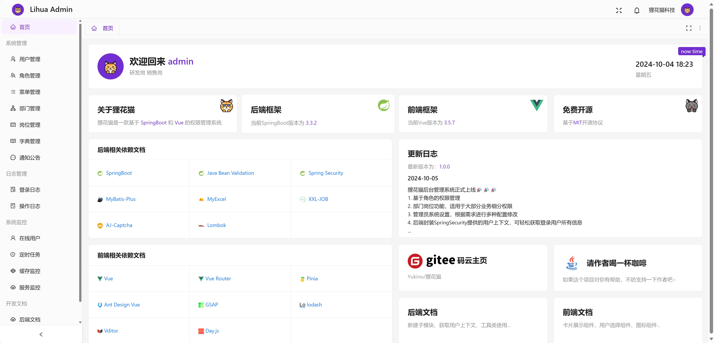
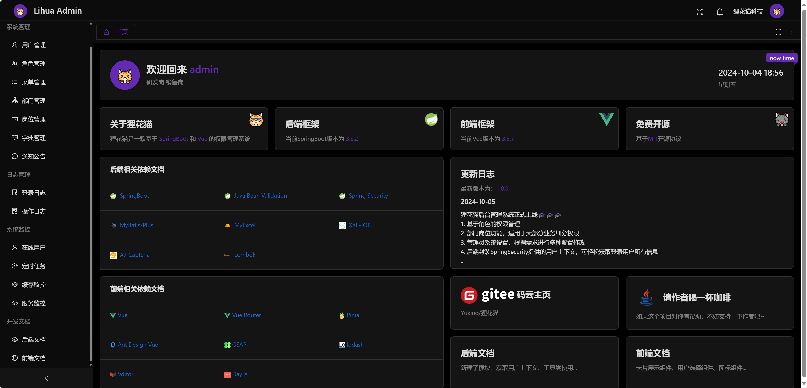
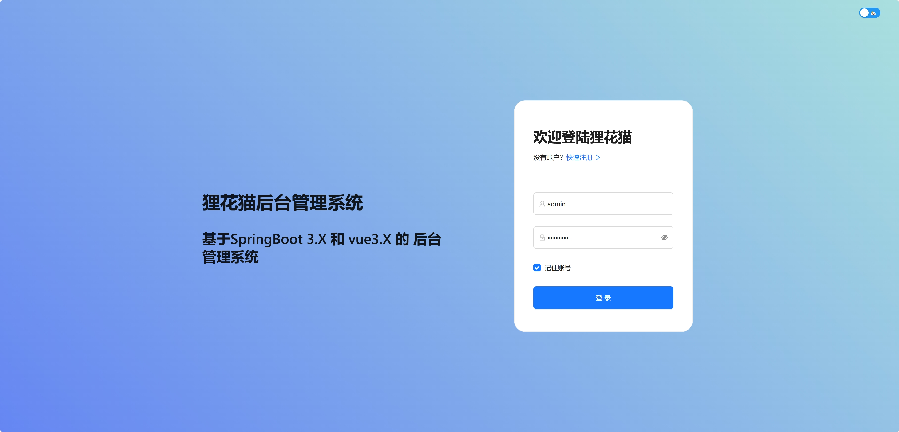
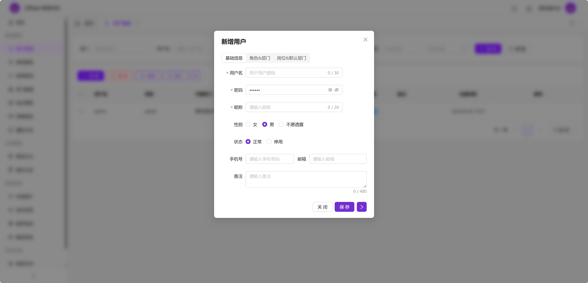
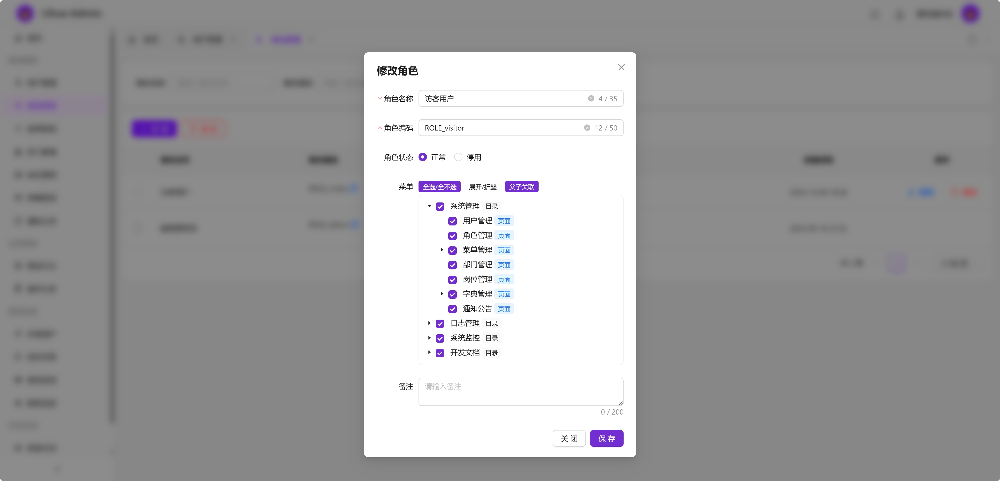
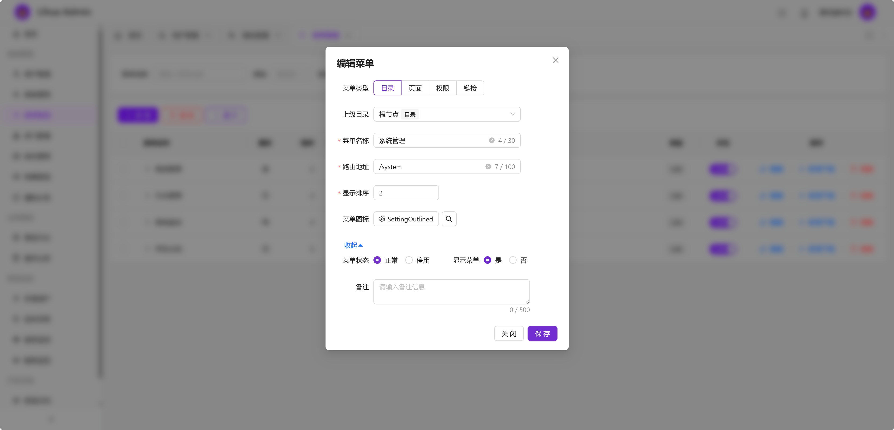
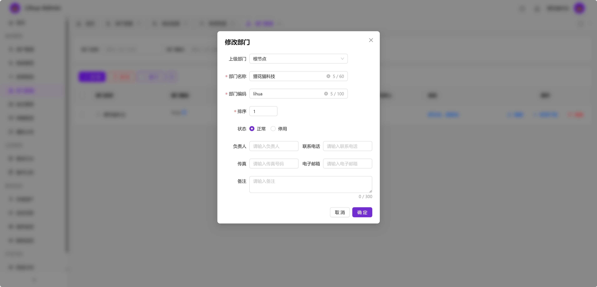
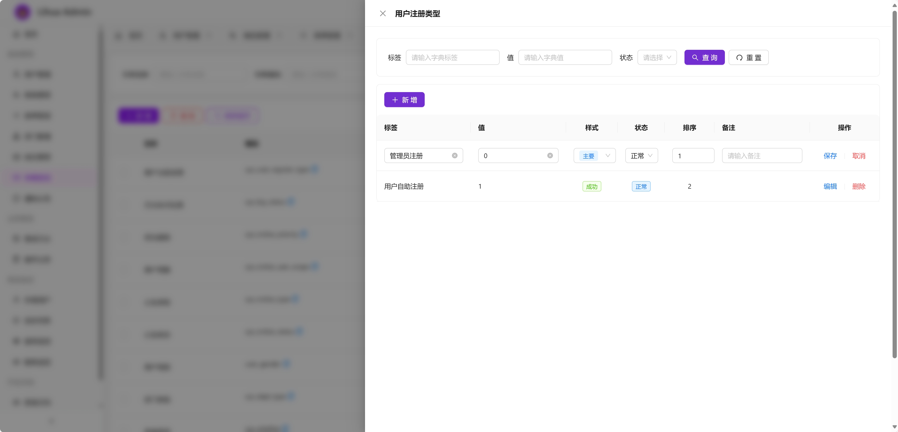
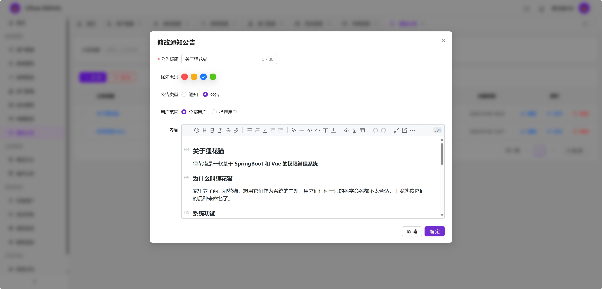
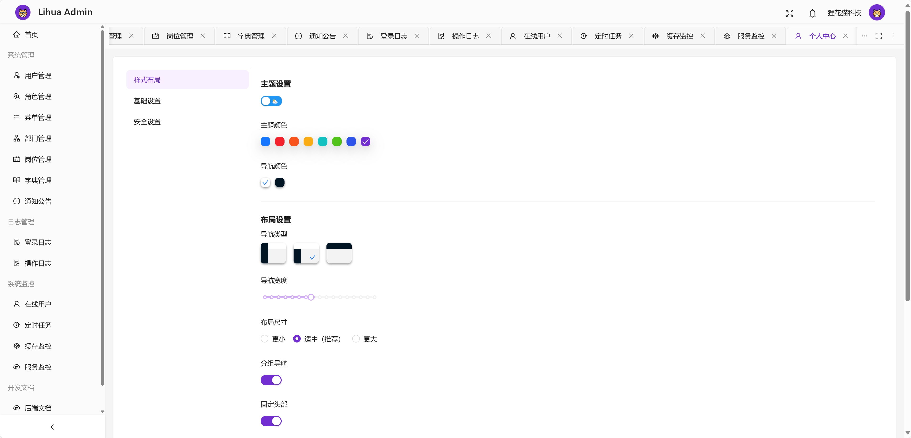
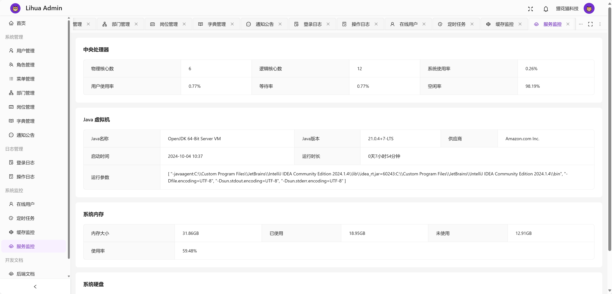
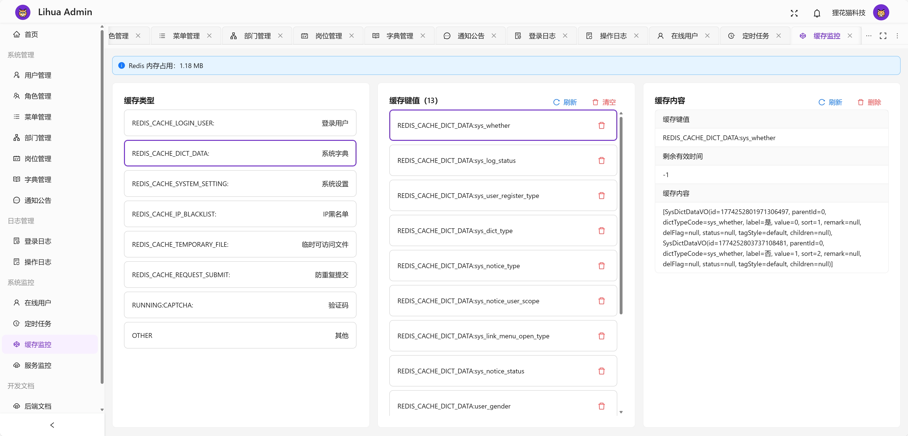
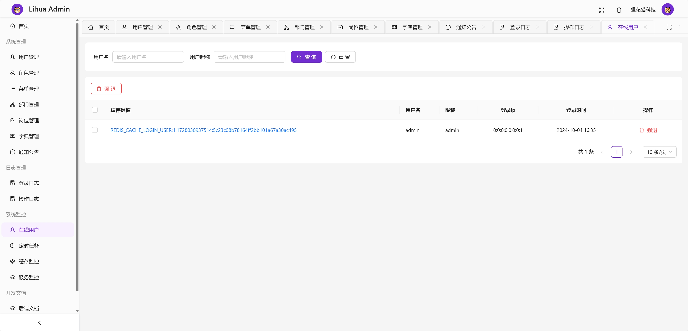
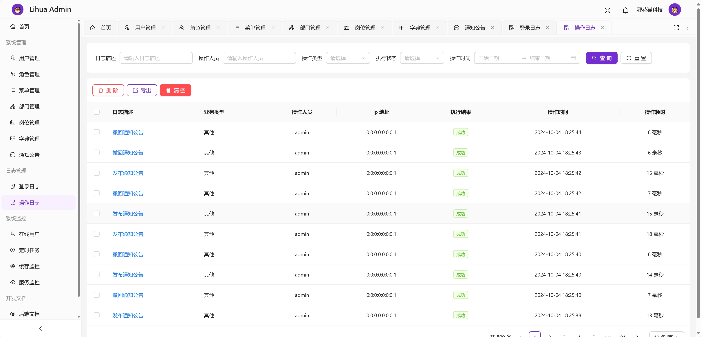
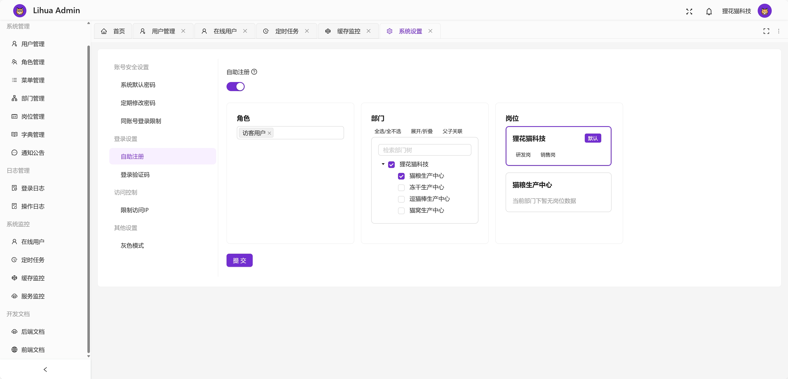
